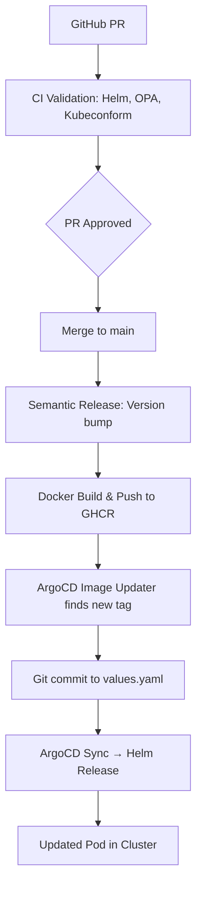

**Архитектурный анализ**, с точки зрения GitOps и продакшен-практик:

---

## 🧠 Что делает твой CI: архитектурная сводка

| Категория                | Что делает                                         | GitOps функция                                        | Продакшен комментарий                    |
| ------------------------ | -------------------------------------------------- | ----------------------------------------------------- | ---------------------------------------- |
| 🧪 **Validation CI**     | Линт, шаблонизация Helm, `kubeconform`, OPA policy | Проверка синтаксиса и политики до попадания в кластер | ✅ Отличная практика shift-left           |
| 🐍 **App Tests**         | Тесты на `pytest`, `mypy`, `ruff`                  | Юнит- и типизация кода                                | ✅ Качество кода и поведение              |
| 🚀 **Release CI**        | Semantic-release → тег → Docker → GHCR push        | Образы с версией попадают в registry                  | ✅ Прямая интеграция с Argo Image Updater |
| 🔐 **Branch Protection** | Terraform управляет GitHub ветками                 | GitOps контроль доступа                               | ✅ Инфраструктура репозитория как код     |

---

## 🔄 Как это связано с Argo CD и Image Updater

Вот полный GitOps-поток:

```
Code push (PR) →
  🔹 CI: Lint + Helm Render + Kubeconform + OPA →
    ✅ PR Passed →
    ✅ Merge to main →
      🔸 CI: Semantic-release → Docker Image (v1.0.X) →
        🔸 Push в GHCR →
          🔸 Argo Image Updater видит новую версию →
            🔸 Коммитит в values.yaml (если есть права) →
              🔸 Argo CD Application подхватывает изменения →
                🔸 Sync → Deploy в кластер
```

---

## ⚙️ Рекомендации и улучшения

| Область                 | Что можно улучшить                                     | Почему                                                               |
| ----------------------- | ------------------------------------------------------ | -------------------------------------------------------------------- |
| ✅ Semantic release      | ✅ Отлично, создаёт образы с тегами и latest            | —                                                                    |
| ✅ Kubeconform + OPA     | Очень хорошо! Shift-left валидация                     | —                                                                    |
| 🛠️ Артефакты CI        | Сейчас сохраняется только 1 файл `rendered.yaml`       | Можешь ещё сохранять `.version`, `.image-tag` и `policy-results.txt` |
| ⚠️ Secrets в Argo       | Не видно в CI логике генерации SealedSecrets           | Добавить `kubeseal` и валидацию зашифрованных секретов               |
| ⚠️ Мониторинг           | Нет алертов на CI фейлы / Docker release / sync ArgoCD | Можно интегрировать GitHub → Alertmanager или Telegram через webhook |
| 🚀 Progressive delivery | Пока только стандартный sync через ArgoCD              | Можешь добавить `Argo Rollouts` для Blue/Green и Canary              |

---

## 📁 Советы по структуре и значениям

> **Q:** “Значения где лучше тащить?”

* Helm → через `valueFiles` (dev, prd, ...).
* CI → всегда брать `values.yaml` + `${{ matrix.env }}-values.yaml`
* Argo Image Updater → указывать точный `helm.image-tag` путь (например: `chat.image.tag` или `image.tag`, зависит от структуры)

---

## 🔗 Полный путь от коммита до кластера



---

Хочешь, я подготовлю тебе фрагмент `ApplicationSet` или `.argocd-image-updater-config.yaml`, чтобы он точно коммитил в нужные overlay-файлы (`infra/clusters/dev/chat-values.yaml` и т.п.) с поддержкой множественных сред?
